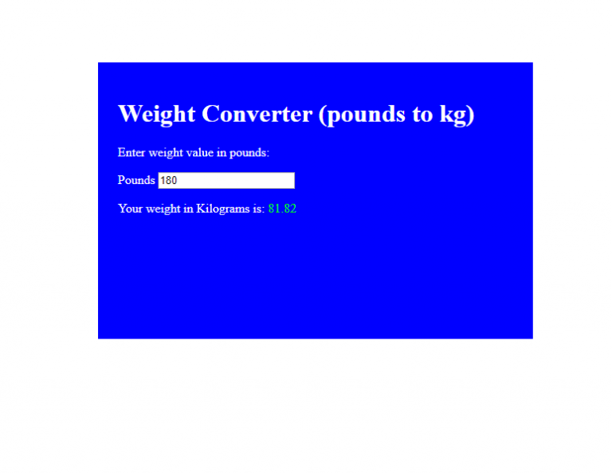

# Pound to Kilogram Conversion Calculator 

Small pound to kilogram weight conversion add.

# What You Should See
Visit the hosted github page to see this [Pound to Kilogram Calculator](https://romeojeremiah.github.io/weight-converter/) in action.

# Project Objective
The objective of this JavaScript project is to wire up a very basic JavaScript weight conversion calculator.

# JavaScript Used
* JavaScript conditionals
* JavaScript addEventListener property
* JavaScript CSS selectors

# Project descriptions
The calculator requires just one input, your weight in pounds. Once you give the value to your calculator and press the enter key, your calculator returns the value of your weight in kilograms. 
